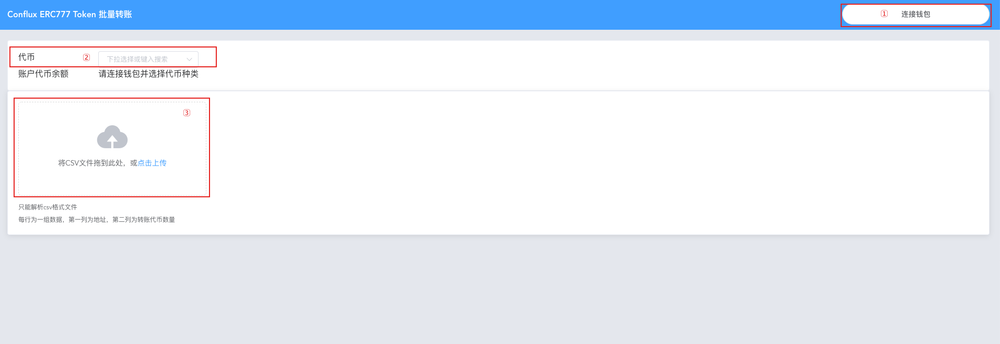
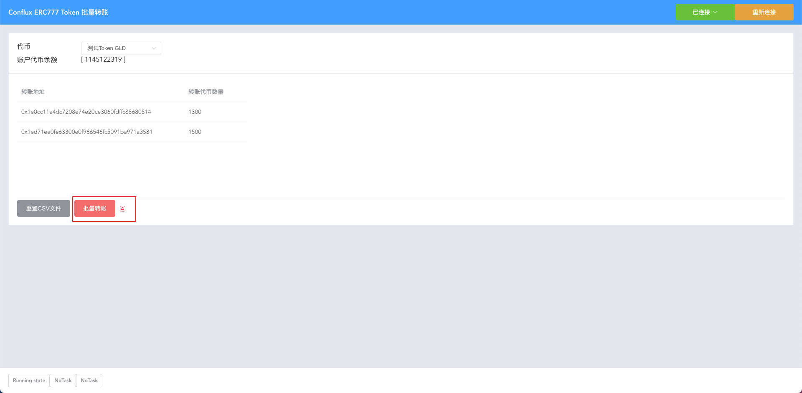
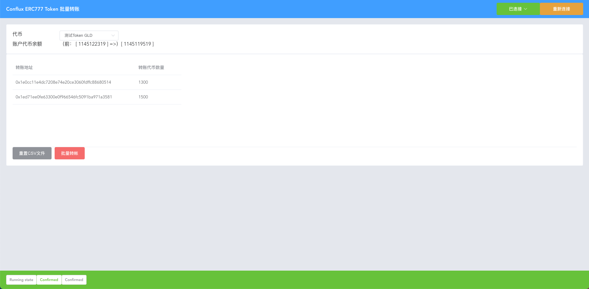

- [TokenBatchSender](#tokenbatchsender)
  - [Setup](#setup)
  - [合约](#合约)
    - [已编译的合约](#已编译的合约)
    - [手动编译合约](#手动编译合约)
    - [部署合约](#部署合约)
  - [Dapp](#dapp)
    - [手动更改 Dapp 配置](#手动更改-dapp-配置)
    - [运行 Dapp 前端](#运行-dapp-前端)
      - [在测试环境中编译运行，并可以进行热重载](#在测试环境中编译运行并可以进行热重载)
      - [生成用于生产环境的静态文件](#生成用于生产环境的静态文件)
    - [Dapp 输入 CSV 格式要求](#dapp-输入-csv-格式要求)
  - [Dapp 使用](#dapp-使用)

# TokenBatchSender
TokenBatchSender 用于 cfx token 与 erc777 token 的批量转账

## Setup

运行以下命令
``` bash
npm install

cd ./frontend

npm install
```

使用 Dapp 需要安装 Chrome 扩展 `Conflux Portal`

## 合约

### 已编译的合约

文件夹 `/build/contracts` 中提供了已编译的合约

### 手动编译合约

需要修改 `node_modules/@openzeppelin/contracts/token/ERC777/ERC777.sol` 第33行 为
``` solidity
IERC1820Registry constant internal _ERC1820_REGISTRY = IERC1820Registry(0x88887eD889e776bCBe2f0f9932EcFaBcDfCd1820);
```
ERC1820 在 Conflux 网络中的地址与以太坊不同，因此这里需要修改 ERC1820合约的地址。
`DMDToken.sol` 与 `GLDToken.sol`为测试环境使用的示例ERC777合约。`GLD20.sol`为测试环境使用的示例ERC20合约。

之后运行
``` bash
// 需要安装 truffle 或 cfxtruffle 
truffle compile

// or

cfxtruffle compile
```


### 部署合约

可以直接使用 `./build/contracts/TransferToken.json` 文件进行部署。`TransferToken.json` 使用地址数组`trusted_contracts`作为初始化的参数，只有从该数组中的合约地址发送的批量转账请求才会被接受。

## Dapp

### 手动更改 Dapp 配置

这一步需要指定在 [部署合约](#部署合约) 中部署的合约地址
在 `frontend/src/contracts-config.js` 中指定变量 `options` 与 `routingContractAddress` 的值用于配置Dapp.

``` javascript
//frontend/src/contracts-config.js

/* specify token to select in Dapp.
 contractName: primary key
 label: label displayed in Dapp frontend
 address: specify contract address
 disabled: disable option will be displayed as 'disabled' in Dapp frontend (defalut to false)
*/ 
const options = [
  {
    contractName: "GLD",
    label: "测试Token GLD",
    address: "cfxtest:type.contract:ace59n3pj2ev5f1j3vdcfr39nm9kc8dgde1d83a384"
  },
  {
    contractName: "DMD",
    label: "测试Token DMD",
    address: "cfxtest:type.contract:acg4kb024uwn2cr9682s5ar0yk7zx2vuja20bwrx46",
    disabled: false
  }
]

// specify TransferToken.json address
const routingContractAddress = "blabla"
```

### 运行 Dapp 前端
#### 在测试环境中编译运行，并可以进行热重载

```
cd ./frontend
npm run serve
```

#### 生成用于生产环境的静态文件

```
cd ./frontend
npm run build
```

### Dapp 输入 CSV 格式要求
Dapp 需要用户输入csv文件才能运行。程序要求是一个n行2列的csv  
在 `./frontend/src/example/example.csv` 中提供了一个示例
``` csv
// address, token to transfer
0x1e0cc11e4dc7208e74e20ce3060fdffc88680514, 1300
0x1ed71ee0fe63300e0f966546fc5091ba971a3581, 1500
```

## Dapp 使用
1. 连接钱包
2. 选择转账的代币
3. 从磁盘选择csv文件 [Dapp 输入 CSV 格式要求](#dapp-输入-csv-格式要求)


4. 进行代币转账


5. 等待交易完成

