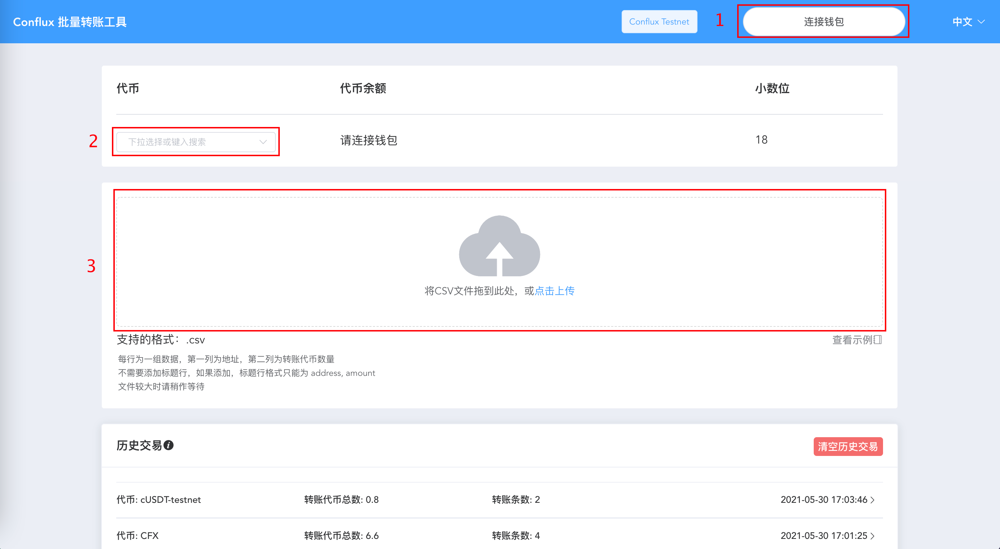
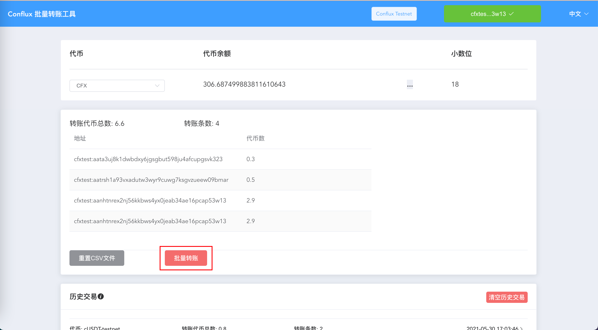
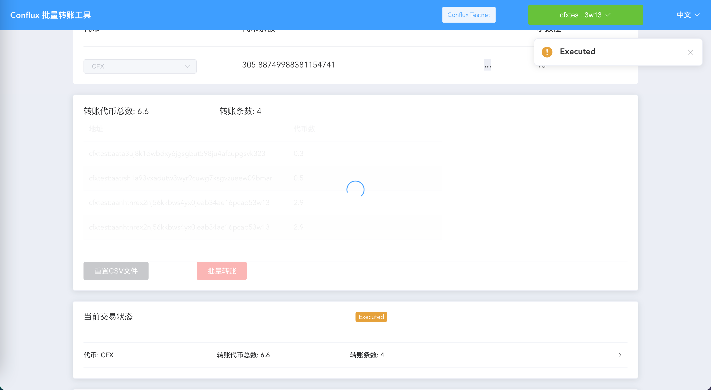
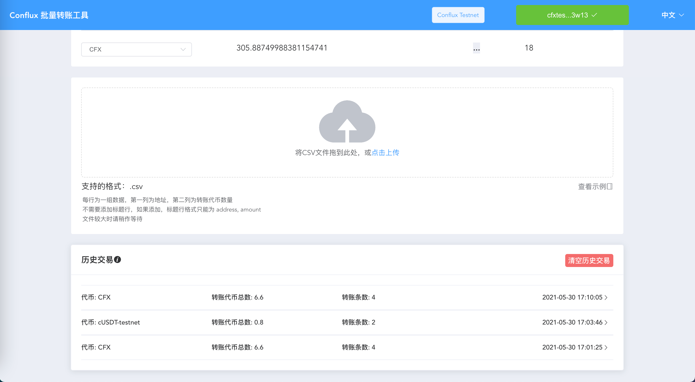

# TokenBatchSender

TokenBatchSender 用于 CFX 与 ERC777 token 的批量转账

- [TokenBatchSender](#tokenbatchsender)
  - [项目主体结构](#项目主体结构)
  - [环境配置](#环境配置)
  - [Dapp 部分说明](#dapp-部分说明)
    - [Dapp 配置文件说明](#dapp-配置文件说明)
    - [vue 命令说明](#vue-命令说明)
      - [启动前端开发环境](#启动前端开发环境)
      - [生成前端静态文件](#生成前端静态文件)
      - [部署静态文件](#部署静态文件)
  - [合约部分说明](#合约部分说明)
    - [编译合约（可选）](#编译合约可选)
    - [批量转账合约部署与配置](#批量转账合约部署与配置)
  - [用户使用说明](#用户使用说明)
    - [Dapp 输入 CSV 格式要求](#dapp-输入-csv-格式要求)
    - [Dapp 使用](#dapp-使用)
  - [更新日志](#更新日志)

## 项目主体结构

项目大体分为 `solidity` 合约与 `vue` 前端两部分。

- `/contracts` 与 `/build/contracts` 为合约部分。本项目中的合约包括用于批量转账的批量转账合约与用于测试的代币合约。其中 `/contracts` 中为 `solidity` 合约源码，`/build/contracts` 为编译后得到的 `JSON` 文件。
- `/frontend` 中为 `vue` 前端的源码。

## 环境配置

安装依赖

```bash
npm install

cd ./frontend

npm install
```

本项目中合约已经编译完毕(于`/build/contracts`)，未修改合约前不必再次编译。  
如果需要编译合约，需要安装 `truffle` 或 `cfxtruffle`。

> 其余 `solidity` 编译工具理论上也可以使用，但是没有进行过测试

```bash
npm install -g conflux-truffle
```

此外，本项目前端依赖于浏览器扩展 [Conflux Portal](https://portal.confluxnetwork.org/)

## Dapp 部分说明

### Dapp 配置文件说明

批量转账合约地址与批量转账支持的代币种类通过读取前端的合约配置文件 `/frontend/src/contracts-config/routingContractConfig.js` 与 `/frontend/src/contracts-config/tokenConfig.js` 获取。下面简单介绍如何修改

```javascript
// routingContractConfig.js

// 修改下面两个变量的值可以修改批量转账合约地址
// 要求分别为 CIP-37 格式的测试网地址与主网地址
const testnetRoutingContractAddress = "cfxtest:xxxxx";
const mainnetRoutingContractAddress = "cfx:xxxxx";
```

```javascript
// tokenConfig.js

/*
 options 数组中为支持的代币
 需要新增代币时需要向 options 数组中增加新的对象
*/
const options = [
  {
    contractName: "GLD", // 唯一标识符，数组内元素该字段不可重复
    label: "GLD - testnet token", // 前端页面会显示此名称
    address: "cfxtest:ace0ea1x6st1spm1jwfces43tder2yewz2vtx8hxrt", // 要求为 CIP-37 格式的地址
  },
  // ....
];
```

**此外，如果重新部署了合约或在配置列表中增加了新 Token，还需要对合约进行相应的配置。参考[批量转账合约部署与配置](#批量转账合约部署与配置)**

### vue 命令说明

前端基于 `vue-cli` 搭建，下面进行简单说明

#### 启动前端开发环境

开发环境下允许热重载

```bash
cd ./frontend

npm run serve
```

#### 生成前端静态文件

```bash
npm run build
```

#### 部署静态文件

```
npm run deploy
```

该命令会执行 `/frontend/deploy.sh` 脚本，将 `/frontend/dist` 文件中内容推送至远程对应的仓库与分支。如果提前部署了 github pages 类似的服务（或提前设置了远端仓库的钩子函数）可以实现部署的效果。

## 合约部分说明

### 编译合约（可选）

使用 `cfxtruffle` 编译

```bash
cfxtruffle compile
```

### 批量转账合约部署与配置

可以直接使用 `./build/contracts/TransferToken.json` 文件进行部署。`TransferToken.json` 使用地址数组`trusted_contracts`作为初始化的参数，只有从该数组中的合约地址发送的批量转账请求才会被接受。

## 用户使用说明

### Dapp 输入 CSV 格式要求

Dapp 使用中需要用户从磁盘中选择 csv 文件才能运行。该 csv 文件需要是一个 n 行 2 列的 csv 文件 。

> 地址可以是 0x 开头的十六进制地址，也可以是 CIP-37 格式的地址。
> 测试网中可以使用十六进制地址、主网或测试网前缀的 CIP-37 地址
> 主网中只能使用十六进制地址与主网前缀的 CIP-37 地址

> 空行会被忽略

> csv 不要求第一行为标题行。如果填写标题行，格式需要为 address, amount

在 `./frontend/src/example/example.csv` 中提供了一个示例。

```csv
0x1e0cc11e4dc7208e74e20ce3060fdffc88680514, 1300
0x1ed71ee0fe63300e0f966546fc5091ba971a3581, 1500
```

### Dapp 使用

> 需要浏览器扩展 [Conflux Portal](https://portal.confluxnetwork.org/)
>
> 可以在右上角切换语言，目前支持中文与英文
>
> 在`ConfluxPortal`中切换主网与测试网

1. 连接钱包
2. 选择转账的代币
3. 从磁盘选择 csv 文件 [Dapp 输入 CSV 格式要求](#dapp-输入-csv-格式要求)
   

4. 进行代币转账
   

5. 等待交易确认，此时可以查看当前交易状态。交易确认前将无法进行其他操作
   

6. 交易确认后可以继续进行转账。也可以在 `历史交易` 中查看已确认的交易。如果在确认前就关闭页面或刷新页面，相应交易信息将不会列入历史交易
   

## 更新日志

2021/06/09 0.9.0
2021/06/23 修复windows系统下csv文件格式判断的问题
2021/07/05 修复了加载大CSV文件时的卡顿问题
