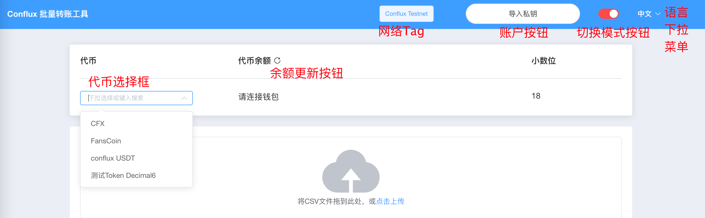

# account-and-balance usecases

## set account 设置账户

### contract mode 合约模式（非批量转账模式）

0. 当前模式为合约模式
1. 点击右上角账户按钮（连接），在 Conflux portal 中进行授权
2. 授权成功，账户按钮变为绿色方形，并显示简版账户地址
3. 点击按钮，弹出对话框，可以点击账户地址。点击后会在新窗口中访问confluxscan的地址详情页

### direct sending mode 直接发送模式

#### 导入 keystore 文件

0. 当前模式为直接发送模式
1. 点击右上角账户按钮（导入私钥），跳出对话框，能导入keystore文件或直接输入私钥
2. 点击选择私钥文件，会弹出选择文件对话框，从中选择keystore文件
   - 无法选择超过一个文件
3. 选择后会出现输入口令框
   - 此时点击 “x” 移除已选择的文件后，口令输入框也会消失
4. 输入 keystore文件对应的口令，点击确认
   - 如果文件格式有误 / 口令错误会报错
   - 可以使用以太坊的 keystore 文件
5. 导入成功，账户按钮变为绿色方形，并显示简版账户地址
6. 点击按钮，弹出对话框，可以点击账户地址。点击后会在新窗口中访问confluxscan的地址详情页

#### 直接输入私钥

0. 当前模式为直接发送模式
1. 点击右上角账户按钮（导入私钥），跳出对话框，能导入keystore文件或直接输入私钥
2. 点击“直接输入私钥”
3. 
4. 导入成功，账户按钮变为绿色方形，并显示简版账户地址
5. 点击按钮，弹出对话框，可以点击账户地址。点击后会在新窗口中访问confluxscan的地址详情页

## logout 账户登出

0. 已设置账户
1. 点击（绿色方形的）账户按钮
2. 弹出对话框，点击对话框中黄色的登出按钮
3. 点击后，右上角账户按钮变回白色圆框，代币余额处消失
   - 合约模式下可以再次导入私钥
   - 短时间内非合约模式下再次点击通常会直接授权（portal的限制）

## 查看余额 / 切换代币

### 先设置账户再查看余额

0. 账户已设置
1. 代币余额显一栏显示“请选择代币”
2. 在代币选择框中选择代币
3. 代币小数位会更新，代币余额更新

### 先选择代币再查看余额

1. 在代币选择框中选择代币
2. 代币余额一栏显示“请连接钱包”
3. 设置账户
4. 代币小数位会更新，代币余额更新

## 手动更新余额

余额只会在某些事件后更新，但可以通过点击余额更新按钮进行手动更新

0. 已设置账户 已选择代币
1. “代币余额” 旁会显示刷新按钮
2. 点击按钮，余额会更新，且会弹出通知“余额已更新”
