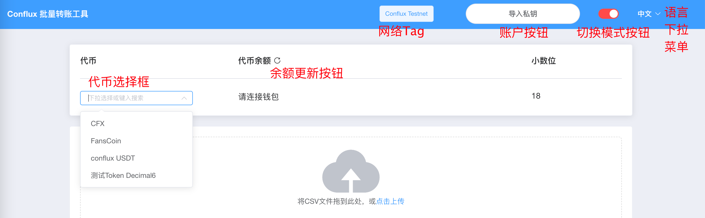

# mode-and-network usecases

## 没有安装 ConfluxPortal 扩展

1. 没有安装 ConfluxPortal 扩展时进入网页
2. 会弹出对话框“未检测到ConfluxPortal“ 且对话框无法关闭

## 切换模式

1. 点击切换模式按钮，模式会在 合约模式/直接发送模式 间进行切换，且页面会刷新
2. 不同模式下账户按钮上的文字不同
3. 刷新页面后后设置仍然适用

## 网络

1. 网络 Tag 上会根据 ConfluxPortal 中设置的网络显示当前网络
   - 注意即使是直接发送模式也需要ConfluxPortal确定当前网络
   - 非 testnet/主网 会显示netid
2. 在ConfluxPortal中切换网络，页面会刷新，同时网络也会变更

## 切换语言

1. 点击语言下拉菜单，可以在中文与英文间切换语言
2. 可以选择语言，选择后页面的显示语言会变更
3. 刷新页面后后设置仍然适用
